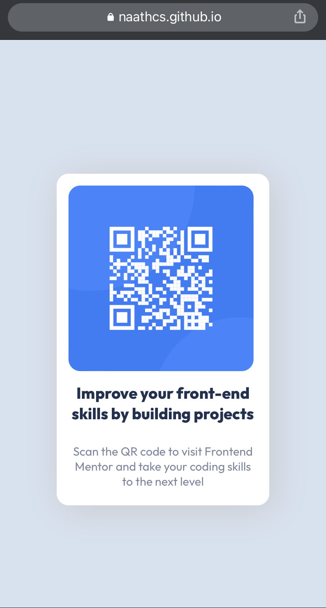

# Frontend Mentor - QR code component solution

This is a solution to the [QR code component challenge on Frontend Mentor](https://www.frontendmentor.io/challenges/qr-code-component-iux_sIO_H).
Frontend Mentor challenges help you improve your coding skills by building realistic projects.

## Table of contents

- [Overview](#overview)
  - [Screenshot](#screenshot)
  - [Links](#links)
- [My process](#my-process)
  - [Built with](#built-with)
  - [What I learned](#what-i-learned)
  - [Continued development](#continued-development)
  - [Useful resources](#useful-resources)
- [Author](#author)


## Overview

Challenge from FrontEnd Mentor to create a QR Code component hub using HTML and CSS.
The HTML structure was mostly done, I had to only adapt to what I felt more appropriate to the challenge.

### Screenshot





### Links

- Solution URL: [Github Code](https://github.com/naathcs/QR-code-component-hub)
- Live Site URL: [Github Pages](https://naathcs.github.io/QR-code-component-hub/)

## My process

I started analyzing the HTML file that was provided and what I would change in order to create necessary classes to use in the CSS file.
I decided to stick with HTML and CSS only because I am more confident using things that I know for a first time and then move to new elements as I do more challenges.

After HTML was done, I commented the image and text in order to create a card as similar as possible to the .jpeg design.
After the card was done, I uncommented the image and worked to be again as similar as the available design.
Lastly, I uncommented the the text and checked the whole process on my browser. I inspected the page and made changes on the inspect page until I was satisfied with the result. Then I putted the changes I found necessary on the CSS file and checked one more time how it looked on my browser.

### Built with

- Semantic HTML5 markup
- CSS custom properties
- Flexbox
- CSS Grid

### What I learned

Using elements for the first time was a different thing for me. As we are always learning in this field, it was quite satifying to see things working as expected.
I read the documentation on [MDN](https://developer.mozilla.org/en-US/docs/Web/CSS/box-shadow) and [DevDocs](https://devdocs.io/css/flex-direction) about some items I was adding to my CSS.

Some code snippets, see below:


```css
.qr-code-box {
  background: hsl(0, 0%, 100%);
  display: flex;
  flex-direction: column;
  box-shadow:5px 5px 50px hsl(220, 5%, 80%);
}
```

It was very interesting to use new things like Flexbox, hsl and box shadow for the first time. I hope to more in the future and with more confidence as well.

### Continued development

I want to improve my knowledge in HTML and CSS before moving to add Javascript to my code.
I also want to be able to feel comfortable using new things.
I felt like it was not fair to use some small blocks in CSS because I didn't fully understand what I was doing.

### Useful resources

- [Box Shadow](https://www.w3schools.com/cssref/css3_pr_box-shadow.asp) - This helped me to understand how to use the box shadow and what each number of the element means.

- [Color Value: hsl](https://devdocs.io/css/color_value#hsla()) - I learned about hls() and its use in CSS. It is interesting because the most common form is hexadecimal or rgba() and I have never heard of hsl until now. It was very interesting to use it for the first time.

## Author

- Website - [Github](https://github.com/naathcs)
- Frontend Mentor - [@naathcs](https://www.frontendmentor.io/profile/naathcs)
- Instagram - [@naath.cs](https://www.instagram.com/naath.cs)
